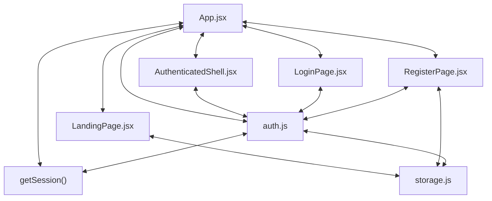

# Codebase Architectural Report

> **Auto-generated** by graphify knowledge graph analysis  
> **Purpose**: Dependency map, connection analysis, subsystem breakdown, and quality hotspots.

---

## 1. Executive Summary

- **Total Components**: `49`
- **Total Connections**: `94`
- **Subsystem Modules**: `7`
- **Dependency Types**: `4`

**Key Architectural Hubs:**

| # | Component | File | Type | Connections |
|---|-----------|------|------|-------------|
| 1 | `App.jsx` | `frontend/src/App.jsx` | class | 16 |
| 2 | `auth.js` | `frontend/src/utils/auth.js` | file | 14 |
| 3 | `storage.js` | `frontend/src/utils/storage.js` | file | 11 |
| 4 | `LandingPage.jsx` | `frontend/src/pages/LandingPage.jsx` | class | 10 |
| 5 | `RegisterPage.jsx` | `frontend/src/pages/RegisterPage.jsx` | class | 10 |
| 6 | `LoginPage.jsx` | `frontend/src/pages/LoginPage.jsx` | class | 7 |
| 7 | `getSession()` | `frontend/src/utils/auth.js` | method | 7 |
| 8 | `AuthenticatedShell.jsx` | `frontend/src/components/AuthenticatedShell.jsx` | class | 6 |

---

## 2. Dependency & Connection Analysis

### Relationship Types

| Relationship | Count | Share |
|-------------|-------|-------|
| `contains` | 31 | 33% |
| `imports` | 28 | 30% |
| `imports_from` | 21 | 22% |
| `calls` | 14 | 15% |

### Hub Dependency Diagram

### Most Connected Pairs

| Component A | Component B | Shared Connections |
|-------------|-------------|-------------------|
| `access.spec.js` | `capturePageErrors()` | 1 |
| `App()` | `App.jsx` | 1 |
| `App.jsx` | `ProtectedPlaceholder()` | 1 |
| `App.jsx` | `AuthenticatedShell.jsx` | 1 |
| `App.jsx` | `AuthenticatedShell()` | 1 |
| `App.jsx` | `ProtectedRoute.jsx` | 1 |
| `App.jsx` | `ProtectedRoute()` | 1 |
| `App.jsx` | `LandingPage.jsx` | 1 |
| `App.jsx` | `LandingPage()` | 1 |
| `App.jsx` | `LoginPage.jsx` | 1 |

---

## 3. Subsystem & Module Breakdown

### 3.1 frontend/src
**Nodes**: `22`  
**Files**: `frontend/src/App.jsx`, `frontend/src/components/AuthenticatedShell.jsx`, `frontend/src/components/Avatar.jsx`, `frontend/src/components/ProtectedRoute.jsx`, `frontend/src/main.jsx`, `frontend/src/pages/AccessPages.test.jsx` +3 more

| Component | Type | File | Connections |
|-----------|------|------|-------------|
| `App.jsx` | class | `frontend/src/App.jsx` | 16 |
| `auth.js` | file | `frontend/src/utils/auth.js` | 14 |
| `LoginPage.jsx` | class | `frontend/src/pages/LoginPage.jsx` | 7 |
| `getSession()` | method | `frontend/src/utils/auth.js` | 7 |
| `AuthenticatedShell.jsx` | class | `frontend/src/components/AuthenticatedShell.jsx` | 6 |
| `setSession()` | method | `frontend/src/utils/auth.js` | 5 |
| `authenticate()` | method | `frontend/src/utils/auth.js` | 5 |
| `auth.test.js` | file | `frontend/src/utils/auth.test.js` | 5 |
| `ProtectedRoute.jsx` | class | `frontend/src/components/ProtectedRoute.jsx` | 4 |
| `normalizeSession()` | method | `frontend/src/utils/auth.js` | 4 |

**External dependencies:** `RegisterPage.jsx` (3), `getUsers()` (2), `LandingPage.jsx` (1), `LandingPage()` (1), `RegisterPage()` (1)

### 3.2 frontend/src
**Nodes**: `14`  
**Files**: `frontend/src/components/PublicShell.jsx`, `frontend/src/pages/RegisterPage.jsx`, `frontend/src/utils/storage.js`

| Component | Type | File | Connections |
|-----------|------|------|-------------|
| `storage.js` | file | `frontend/src/utils/storage.js` | 11 |
| `RegisterPage.jsx` | class | `frontend/src/pages/RegisterPage.jsx` | 10 |
| `getUsers()` | method | `frontend/src/utils/storage.js` | 5 |
| `PublicShell.jsx` | class | `frontend/src/components/PublicShell.jsx` | 4 |
| `PublicShell()` | class | `frontend/src/components/PublicShell.jsx` | 4 |
| `getPosts()` | method | `frontend/src/utils/storage.js` | 4 |
| `readArray()` | method | `frontend/src/utils/storage.js` | 3 |
| `writeArray()` | method | `frontend/src/utils/storage.js` | 3 |
| `saveUsers()` | method | `frontend/src/utils/storage.js` | 3 |
| `RegisterPage()` | class | `frontend/src/pages/RegisterPage.jsx` | 2 |

**External dependencies:** `LandingPage.jsx` (4), `auth.js` (3), `App.jsx` (2), `LoginPage.jsx` (2), `LandingPage()` (1)

### 3.5 frontend/src
**Nodes**: `8`  
**Files**: `frontend/src/pages/LandingPage.jsx`, `frontend/src/utils/blog.js`

| Component | Type | File | Connections |
|-----------|------|------|-------------|
| `LandingPage.jsx` | class | `frontend/src/pages/LandingPage.jsx` | 10 |
| `LandingPage()` | class | `frontend/src/pages/LandingPage.jsx` | 6 |
| `blog.js` | file | `frontend/src/utils/blog.js` | 6 |
| `sortPostsNewestFirst()` | method | `frontend/src/utils/blog.js` | 3 |
| `getExcerpt()` | method | `frontend/src/utils/blog.js` | 3 |
| `formatPostDate()` | method | `frontend/src/utils/blog.js` | 3 |
| `validatePost()` | method | `frontend/src/utils/blog.js` | 1 |
| `canManagePost()` | method | `frontend/src/utils/blog.js` | 1 |

**External dependencies:** `App.jsx` (2), `getPosts()` (2), `PublicShell.jsx` (1), `PublicShell()` (1), `storage.js` (1)

### 3.8 frontend/e2e/access.spec.js
**Nodes**: `2`  
**Files**: `frontend/e2e/access.spec.js`

| Component | Type | File | Connections |
|-----------|------|------|-------------|
| `access.spec.js` | file | `frontend/e2e/access.spec.js` | 1 |
| `capturePageErrors()` | method | `frontend/e2e/access.spec.js` | 1 |

### 3.17 frontend
**Nodes**: `1`  
**Files**: `frontend/postcss.config.js`

| Component | Type | File | Connections |
|-----------|------|------|-------------|
| `postcss.config.js` | file | `frontend/postcss.config.js` | 0 |

### 3.18 frontend/src/test
**Nodes**: `1`  
**Files**: `frontend/src/test/setup.js`

| Component | Type | File | Connections |
|-----------|------|------|-------------|
| `setup.js` | file | `frontend/src/test/setup.js` | 0 |

### 3.19 frontend
**Nodes**: `1`  
**Files**: `frontend/tailwind.config.js`

| Component | Type | File | Connections |
|-----------|------|------|-------------|
| `tailwind.config.js` | file | `frontend/tailwind.config.js` | 0 |

---

## 4. API Reference

Public classes and functions by subsystem.

### frontend/src

| Name | Type | File | Connections |
|------|------|------|-------------|
| `App.jsx` | class | `frontend/src/App.jsx` | 16 |
| `LoginPage.jsx` | class | `frontend/src/pages/LoginPage.jsx` | 7 |
| `AuthenticatedShell.jsx` | class | `frontend/src/components/AuthenticatedShell.jsx` | 6 |
| `ProtectedRoute.jsx` | class | `frontend/src/components/ProtectedRoute.jsx` | 4 |
| `App()` | class | `frontend/src/App.jsx` | 3 |
| `ProtectedRoute()` | class | `frontend/src/components/ProtectedRoute.jsx` | 3 |
| `AccessPages.test.jsx` | class | `frontend/src/pages/AccessPages.test.jsx` | 3 |
| `ProtectedPlaceholder()` | class | `frontend/src/App.jsx` | 2 |

### frontend/src

| Name | Type | File | Connections |
|------|------|------|-------------|
| `RegisterPage.jsx` | class | `frontend/src/pages/RegisterPage.jsx` | 10 |
| `PublicShell.jsx` | class | `frontend/src/components/PublicShell.jsx` | 4 |
| `PublicShell()` | class | `frontend/src/components/PublicShell.jsx` | 4 |
| `RegisterPage()` | class | `frontend/src/pages/RegisterPage.jsx` | 2 |
| `POSTS_KEY` | class | `frontend/src/utils/storage.js` | 1 |
| `USERS_KEY` | class | `frontend/src/utils/storage.js` | 1 |

### frontend/src

| Name | Type | File | Connections |
|------|------|------|-------------|
| `LandingPage.jsx` | class | `frontend/src/pages/LandingPage.jsx` | 10 |
| `LandingPage()` | class | `frontend/src/pages/LandingPage.jsx` | 6 |

---

## 5. Code Quality & Architectural Risk Hotspots

### Component Type Distribution

| Type | Count | Share |
|------|-------|-------|
| class | 21 | 43% |
| method | 19 | 39% |
| file | 8 | 16% |
| function | 1 | 2% |

### High-Connectivity Hotspots

**1** component(s) with >15 connections:

| Component | File | Connections |
|-----------|------|-------------|
| `App.jsx` | `frontend/src/App.jsx` | 16 |

### Dependency Cycles

**50** circular dependency loop(s) detected:

| # | Cycle Path |
|---|-----------|
| 1 | `frontend_src_utils_storage → frontend_src_utils_storage_writearray → frontend_src_utils_storage_saveusers` |
| 2 | `frontend_src_utils_storage → frontend_src_utils_storage_saveposts → frontend_src_utils_storage_writearray` |
| 3 | `frontend_src_pages_registerpage → frontend_src_utils_storage → frontend_src_utils_storage_saveusers` |
| 4 | `frontend_src_utils_storage_getposts → frontend_src_utils_storage_readarray → frontend_src_utils_storage` |
| 5 | `frontend_src_utils_storage_getusers → frontend_src_utils_storage_readarray → frontend_src_utils_storage` |
| 6 | `frontend_src_pages_registerpage → frontend_src_utils_storage_getusers → frontend_src_utils_storage` |
| 7 | `frontend_src_utils_auth → frontend_src_utils_storage_getusers → frontend_src_utils_storage` |
| 8 | `frontend_src_utils_auth → frontend_src_utils_auth_authenticate → frontend_src_utils_storage_getusers` |
| 9 | `frontend_src_utils_auth → frontend_src_utils_auth_test → frontend_src_utils_auth_authenticate` |
| 10 | `frontend_src_pages_loginpage → frontend_src_utils_auth_setsession → frontend_src_utils_auth_test → frontend_src_utils_auth_authenticate` |

### Orphaned Components

**3** isolated node(s) with no connections:

| Component | File |
|-----------|------|
| `postcss.config.js` | `frontend/postcss.config.js` |
| `setup.js` | `frontend/src/test/setup.js` |
| `tailwind.config.js` | `frontend/tailwind.config.js` |

---

## 6. How to Navigate

1. **Interactive D3 Map** — open `graph.html` to explore node connections visually.
2. **Knowledge Graph Queries** — use MCP tools (`graph_query`, `graph_explain_node`, `graph_impact_radius`).
