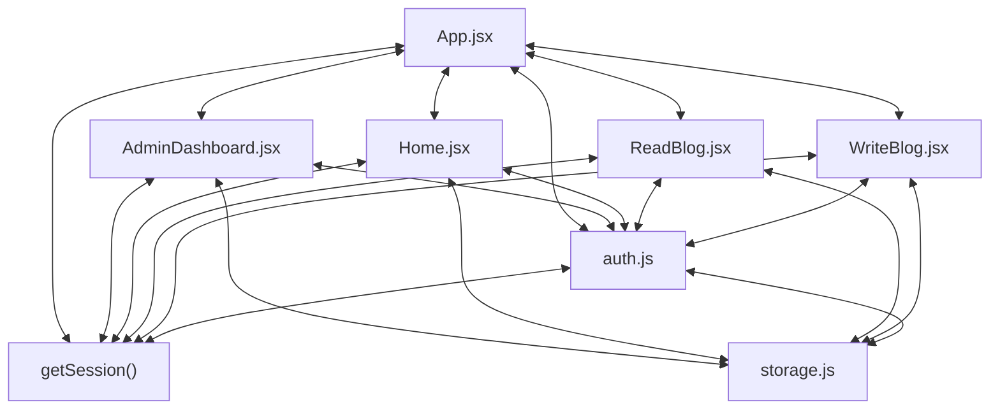

# Codebase Architectural Report

> **Auto-generated** by graphify knowledge graph analysis  
> **Purpose**: Dependency map, connection analysis, subsystem breakdown, and quality hotspots.

---

## 1. Executive Summary

- **Total Components**: `91`
- **Total Connections**: `242`
- **Subsystem Modules**: `13`
- **Dependency Types**: `4`

**Key Architectural Hubs:**

| # | Component | File | Type | Connections |
|---|-----------|------|------|-------------|
| 1 | `App.jsx` | `frontend/src/App.jsx` | class | 29 |
| 2 | `auth.js` | `frontend/src/utils/auth.js` | file | 20 |
| 3 | `storage.js` | `frontend/src/utils/storage.js` | file | 20 |
| 4 | `getSession()` | `frontend/src/utils/auth.js` | method | 17 |
| 5 | `Home.jsx` | `frontend/src/pages/Home.jsx` | class | 16 |
| 6 | `AdminDashboard.jsx` | `frontend/src/pages/AdminDashboard.jsx` | class | 14 |
| 7 | `ReadBlog.jsx` | `frontend/src/pages/ReadBlog.jsx` | class | 14 |
| 8 | `WriteBlog.jsx` | `frontend/src/pages/WriteBlog.jsx` | class | 13 |

---

## 2. Dependency & Connection Analysis

### Relationship Types

| Relationship | Count | Share |
|-------------|-------|-------|
| `imports` | 89 | 37% |
| `imports_from` | 60 | 25% |
| `contains` | 58 | 24% |
| `calls` | 35 | 14% |

### Hub Dependency Diagram

### Most Connected Pairs

| Component A | Component B | Shared Connections |
|-------------|-------------|-------------------|
| `access.spec.js` | `capturePageErrors()` | 1 |
| `admin.spec.js` | `adminSession` | 1 |
| `admin.spec.js` | `capturePageErrors()` | 1 |
| `admin.spec.js` | `seedAdminStorage()` | 1 |
| `blogs.spec.js` | `capturePageErrors()` | 1 |
| `blogs.spec.js` | `seedAuthenticatedStorage()` | 1 |
| `blogs.spec.js` | `session` | 1 |
| `App()` | `App.jsx` | 1 |
| `App.jsx` | `ProtectedPlaceholder()` | 1 |
| `App.jsx` | `AuthenticatedShell.jsx` | 1 |

---

## 3. Subsystem & Module Breakdown

### 3.2 frontend/src
**Nodes**: `21`  
**Files**: `frontend/src/integration/AppFlow.test.jsx`, `frontend/src/pages/AdminPages.test.jsx`, `frontend/src/pages/UserManagement.jsx`, `frontend/src/utils/auth.js`, `frontend/src/utils/storage.js`, `frontend/src/utils/storage.test.js`

| Component | Type | File | Connections |
|-----------|------|------|-------------|
| `storage.js` | file | `frontend/src/utils/storage.js` | 20 |
| `UserManagement.jsx` | class | `frontend/src/pages/UserManagement.jsx` | 12 |
| `getUsers()` | method | `frontend/src/utils/storage.js` | 10 |
| `AdminPages.test.jsx` | class | `frontend/src/pages/AdminPages.test.jsx` | 9 |
| `AppFlow.test.jsx` | class | `frontend/src/integration/AppFlow.test.jsx` | 8 |
| `storage.test.js` | file | `frontend/src/utils/storage.test.js` | 7 |
| `savePosts()` | method | `frontend/src/utils/storage.js` | 6 |
| `POSTS_KEY` | class | `frontend/src/utils/storage.js` | 5 |
| `saveUsers()` | method | `frontend/src/utils/storage.js` | 5 |
| `USERS_KEY` | class | `frontend/src/utils/storage.js` | 4 |

**External dependencies:** `auth.js` (5), `App.jsx` (3), `AdminDashboard.jsx` (3), `RegisterPage.jsx` (3), `getPosts()` (3)

### 3.4 frontend/src
**Nodes**: `18`  
**Files**: `frontend/src/pages/AdminDashboard.jsx`, `frontend/src/pages/Home.jsx`, `frontend/src/pages/LandingPage.jsx`, `frontend/src/pages/ReadBlog.jsx`, `frontend/src/pages/WriteBlog.jsx`, `frontend/src/utils/blog.js` +2 more

| Component | Type | File | Connections |
|-----------|------|------|-------------|
| `AdminDashboard.jsx` | class | `frontend/src/pages/AdminDashboard.jsx` | 14 |
| `WriteBlog.jsx` | class | `frontend/src/pages/WriteBlog.jsx` | 13 |
| `getPosts()` | method | `frontend/src/utils/storage.js` | 13 |
| `blog.js` | file | `frontend/src/utils/blog.js` | 11 |
| `LandingPage.jsx` | class | `frontend/src/pages/LandingPage.jsx` | 10 |
| `formatPostDate()` | method | `frontend/src/utils/blog.js` | 10 |
| `Home()` | class | `frontend/src/pages/Home.jsx` | 8 |
| `canManagePost()` | method | `frontend/src/utils/blog.js` | 8 |
| `sortPostsNewestFirst()` | method | `frontend/src/utils/blog.js` | 8 |
| `LandingPage()` | class | `frontend/src/pages/LandingPage.jsx` | 6 |

**External dependencies:** `App.jsx` (8), `Home.jsx` (7), `getSession()` (6), `ReadBlog.jsx` (5), `storage.js` (4)

### 3.5 frontend/src
**Nodes**: `15`  
**Files**: `frontend/src/App.jsx`, `frontend/src/components/ProtectedRoute.jsx`, `frontend/src/main.jsx`, `frontend/src/pages/AccessPages.test.jsx`, `frontend/src/pages/BlogPages.test.jsx`, `frontend/src/pages/UserManagement.jsx` +1 more

| Component | Type | File | Connections |
|-----------|------|------|-------------|
| `App.jsx` | class | `frontend/src/App.jsx` | 29 |
| `getSession()` | method | `frontend/src/utils/auth.js` | 17 |
| `BlogPages.test.jsx` | class | `frontend/src/pages/BlogPages.test.jsx` | 8 |
| `App()` | class | `frontend/src/App.jsx` | 6 |
| `ProtectedRoute.jsx` | class | `frontend/src/components/ProtectedRoute.jsx` | 5 |
| `ProtectedRoute()` | class | `frontend/src/components/ProtectedRoute.jsx` | 4 |
| `UserManagement()` | class | `frontend/src/pages/UserManagement.jsx` | 4 |
| `AccessPages.test.jsx` | class | `frontend/src/pages/AccessPages.test.jsx` | 3 |
| `ProtectedPlaceholder()` | class | `frontend/src/App.jsx` | 2 |
| `main.jsx` | function | `frontend/src/main.jsx` | 2 |

**External dependencies:** `UserManagement.jsx` (3), `auth.js` (3), `AdminDashboard.jsx` (2), `AdminDashboard()` (2), `Home.jsx` (2)

### 3.6 frontend/src
**Nodes**: `13`  
**Files**: `frontend/src/components/PublicShell.jsx`, `frontend/src/pages/LoginPage.jsx`, `frontend/src/pages/RegisterPage.jsx`, `frontend/src/utils/auth.js`, `frontend/src/utils/auth.test.js`

| Component | Type | File | Connections |
|-----------|------|------|-------------|
| `auth.js` | file | `frontend/src/utils/auth.js` | 20 |
| `RegisterPage.jsx` | class | `frontend/src/pages/RegisterPage.jsx` | 10 |
| `LoginPage.jsx` | class | `frontend/src/pages/LoginPage.jsx` | 7 |
| `PublicShell.jsx` | class | `frontend/src/components/PublicShell.jsx` | 5 |
| `PublicShell()` | class | `frontend/src/components/PublicShell.jsx` | 5 |
| `setSession()` | method | `frontend/src/utils/auth.js` | 5 |
| `authenticate()` | method | `frontend/src/utils/auth.js` | 5 |
| `auth.test.js` | file | `frontend/src/utils/auth.test.js` | 5 |
| `normalizeSession()` | method | `frontend/src/utils/auth.js` | 4 |
| `clearSession()` | method | `frontend/src/utils/auth.js` | 3 |

**External dependencies:** `App.jsx` (5), `getUsers()` (3), `getSession()` (3), `AuthenticatedShell.jsx` (2), `SharedComponents.test.jsx` (2)

### 3.7 frontend/src
**Nodes**: `8`  
**Files**: `frontend/src/components/AuthenticatedShell.jsx`, `frontend/src/components/Avatar.jsx`, `frontend/src/components/SharedComponents.test.jsx`, `frontend/src/pages/Home.jsx`, `frontend/src/pages/ReadBlog.jsx`

| Component | Type | File | Connections |
|-----------|------|------|-------------|
| `Home.jsx` | class | `frontend/src/pages/Home.jsx` | 16 |
| `ReadBlog.jsx` | class | `frontend/src/pages/ReadBlog.jsx` | 14 |
| `AuthenticatedShell.jsx` | class | `frontend/src/components/AuthenticatedShell.jsx` | 12 |
| `AuthenticatedShell()` | class | `frontend/src/components/AuthenticatedShell.jsx` | 8 |
| `SharedComponents.test.jsx` | class | `frontend/src/components/SharedComponents.test.jsx` | 8 |
| `Avatar.jsx` | class | `frontend/src/components/Avatar.jsx` | 5 |
| `Avatar()` | class | `frontend/src/components/Avatar.jsx` | 5 |
| `accentClasses` | function | `frontend/src/pages/Home.jsx` | 1 |

**External dependencies:** `App.jsx` (4), `auth.js` (3), `AdminDashboard.jsx` (2), `UserManagement.jsx` (2), `WriteBlog.jsx` (2)

### 3.8 frontend/e2e/admin.spec.js
**Nodes**: `4`  
**Files**: `frontend/e2e/admin.spec.js`

| Component | Type | File | Connections |
|-----------|------|------|-------------|
| `admin.spec.js` | file | `frontend/e2e/admin.spec.js` | 3 |
| `adminSession` | function | `frontend/e2e/admin.spec.js` | 1 |
| `capturePageErrors()` | method | `frontend/e2e/admin.spec.js` | 1 |
| `seedAdminStorage()` | method | `frontend/e2e/admin.spec.js` | 1 |

### 3.9 frontend/e2e/blogs.spec.js
**Nodes**: `4`  
**Files**: `frontend/e2e/blogs.spec.js`

| Component | Type | File | Connections |
|-----------|------|------|-------------|
| `blogs.spec.js` | file | `frontend/e2e/blogs.spec.js` | 3 |
| `session` | function | `frontend/e2e/blogs.spec.js` | 1 |
| `capturePageErrors()` | method | `frontend/e2e/blogs.spec.js` | 1 |
| `seedAuthenticatedStorage()` | method | `frontend/e2e/blogs.spec.js` | 1 |

### 3.10 frontend/e2e/access.spec.js
**Nodes**: `2`  
**Files**: `frontend/e2e/access.spec.js`

| Component | Type | File | Connections |
|-----------|------|------|-------------|
| `access.spec.js` | file | `frontend/e2e/access.spec.js` | 1 |
| `capturePageErrors()` | method | `frontend/e2e/access.spec.js` | 1 |

### 3.11 vercel.json
**Nodes**: `2`  
**Files**: `vercel.json`

| Component | Type | File | Connections |
|-----------|------|------|-------------|
| `vercel.json` | function | `vercel.json` | 1 |
| `rewrites` | function | `vercel.json` | 1 |

### 3.12 frontend
**Nodes**: `1`  
**Files**: `frontend/playwright.config.js`

| Component | Type | File | Connections |
|-----------|------|------|-------------|
| `playwright.config.js` | file | `frontend/playwright.config.js` | 0 |

### 3.13 frontend
**Nodes**: `1`  
**Files**: `frontend/postcss.config.js`

| Component | Type | File | Connections |
|-----------|------|------|-------------|
| `postcss.config.js` | file | `frontend/postcss.config.js` | 0 |

### 3.14 frontend/src/test
**Nodes**: `1`  
**Files**: `frontend/src/test/setup.js`

| Component | Type | File | Connections |
|-----------|------|------|-------------|
| `setup.js` | file | `frontend/src/test/setup.js` | 0 |

### 3.15 frontend
**Nodes**: `1`  
**Files**: `frontend/tailwind.config.js`

| Component | Type | File | Connections |
|-----------|------|------|-------------|
| `tailwind.config.js` | file | `frontend/tailwind.config.js` | 0 |

---

## 4. API Reference

Public classes and functions by subsystem.

### frontend/src

| Name | Type | File | Connections |
|------|------|------|-------------|
| `UserManagement.jsx` | class | `frontend/src/pages/UserManagement.jsx` | 12 |
| `AdminPages.test.jsx` | class | `frontend/src/pages/AdminPages.test.jsx` | 9 |
| `AppFlow.test.jsx` | class | `frontend/src/integration/AppFlow.test.jsx` | 8 |
| `POSTS_KEY` | class | `frontend/src/utils/storage.js` | 5 |
| `USERS_KEY` | class | `frontend/src/utils/storage.js` | 4 |
| `SESSION_KEY` | class | `frontend/src/utils/auth.js` | 2 |
| `adminSession` | function | `frontend/src/pages/AdminPages.test.jsx` | 1 |
| `defaultAdmin` | function | `frontend/src/pages/UserManagement.jsx` | 1 |

### frontend/src

| Name | Type | File | Connections |
|------|------|------|-------------|
| `AdminDashboard.jsx` | class | `frontend/src/pages/AdminDashboard.jsx` | 14 |
| `WriteBlog.jsx` | class | `frontend/src/pages/WriteBlog.jsx` | 13 |
| `LandingPage.jsx` | class | `frontend/src/pages/LandingPage.jsx` | 10 |
| `Home()` | class | `frontend/src/pages/Home.jsx` | 8 |
| `LandingPage()` | class | `frontend/src/pages/LandingPage.jsx` | 6 |
| `ReadBlog()` | class | `frontend/src/pages/ReadBlog.jsx` | 6 |
| `AdminDashboard()` | class | `frontend/src/pages/AdminDashboard.jsx` | 5 |
| `WriteBlog()` | class | `frontend/src/pages/WriteBlog.jsx` | 5 |

### frontend/src

| Name | Type | File | Connections |
|------|------|------|-------------|
| `App.jsx` | class | `frontend/src/App.jsx` | 29 |
| `BlogPages.test.jsx` | class | `frontend/src/pages/BlogPages.test.jsx` | 8 |
| `App()` | class | `frontend/src/App.jsx` | 6 |
| `ProtectedRoute.jsx` | class | `frontend/src/components/ProtectedRoute.jsx` | 5 |
| `ProtectedRoute()` | class | `frontend/src/components/ProtectedRoute.jsx` | 4 |
| `UserManagement()` | class | `frontend/src/pages/UserManagement.jsx` | 4 |
| `AccessPages.test.jsx` | class | `frontend/src/pages/AccessPages.test.jsx` | 3 |
| `ProtectedPlaceholder()` | class | `frontend/src/App.jsx` | 2 |

### frontend/src

| Name | Type | File | Connections |
|------|------|------|-------------|
| `RegisterPage.jsx` | class | `frontend/src/pages/RegisterPage.jsx` | 10 |
| `LoginPage.jsx` | class | `frontend/src/pages/LoginPage.jsx` | 7 |
| `PublicShell.jsx` | class | `frontend/src/components/PublicShell.jsx` | 5 |
| `PublicShell()` | class | `frontend/src/components/PublicShell.jsx` | 5 |
| `LoginPage()` | class | `frontend/src/pages/LoginPage.jsx` | 2 |
| `RegisterPage()` | class | `frontend/src/pages/RegisterPage.jsx` | 2 |

### frontend/src

| Name | Type | File | Connections |
|------|------|------|-------------|
| `Home.jsx` | class | `frontend/src/pages/Home.jsx` | 16 |
| `ReadBlog.jsx` | class | `frontend/src/pages/ReadBlog.jsx` | 14 |
| `AuthenticatedShell.jsx` | class | `frontend/src/components/AuthenticatedShell.jsx` | 12 |
| `AuthenticatedShell()` | class | `frontend/src/components/AuthenticatedShell.jsx` | 8 |
| `SharedComponents.test.jsx` | class | `frontend/src/components/SharedComponents.test.jsx` | 8 |
| `Avatar.jsx` | class | `frontend/src/components/Avatar.jsx` | 5 |
| `Avatar()` | class | `frontend/src/components/Avatar.jsx` | 5 |
| `accentClasses` | function | `frontend/src/pages/Home.jsx` | 1 |

### frontend/e2e/admin.spec.js

| Name | Type | File | Connections |
|------|------|------|-------------|
| `adminSession` | function | `frontend/e2e/admin.spec.js` | 1 |

### frontend/e2e/blogs.spec.js

| Name | Type | File | Connections |
|------|------|------|-------------|
| `session` | function | `frontend/e2e/blogs.spec.js` | 1 |

### vercel.json

| Name | Type | File | Connections |
|------|------|------|-------------|
| `vercel.json` | function | `vercel.json` | 1 |
| `rewrites` | function | `vercel.json` | 1 |

---

## 5. Code Quality & Architectural Risk Hotspots

### Component Type Distribution

| Type | Count | Share |
|------|-------|-------|
| class | 35 | 38% |
| method | 33 | 36% |
| file | 13 | 14% |
| function | 10 | 11% |

### High-Connectivity Hotspots

**5** component(s) with >15 connections:

| Component | File | Connections |
|-----------|------|-------------|
| `App.jsx` | `frontend/src/App.jsx` | 29 |
| `auth.js` | `frontend/src/utils/auth.js` | 20 |
| `storage.js` | `frontend/src/utils/storage.js` | 20 |
| `getSession()` | `frontend/src/utils/auth.js` | 17 |
| `Home.jsx` | `frontend/src/pages/Home.jsx` | 16 |

### Dependency Cycles

**160** circular dependency loop(s) detected:

| # | Cycle Path |
|---|-----------|
| 1 | `frontend_src_utils_storage → frontend_src_utils_storage_users_key → frontend_src_utils_storage_test` |
| 2 | `frontend_src_utils_storage → frontend_src_pages_adminpages_test → frontend_src_utils_storage_users_key` |
| 3 | `frontend_src_utils_storage_posts_key → frontend_src_pages_adminpages_test → frontend_src_utils_storage_users_key → frontend_src_utils_storage_test` |
| 4 | `frontend_src_app → frontend_src_app_app → frontend_src_pages_adminpages_test` |
| 5 | `frontend_src_integration_appflow_test → frontend_src_app_app → frontend_src_pages_adminpages_test → frontend_src_utils_storage_users_key` |
| 6 | `frontend_src_app → frontend_src_pages_blogpages_test → frontend_src_app_app` |
| 7 | `frontend_src_utils_storage → frontend_src_pages_blogpages_test → frontend_src_app_app → frontend_src_pages_adminpages_test` |
| 8 | `frontend_src_utils_storage_posts_key → frontend_src_pages_blogpages_test → frontend_src_app_app → frontend_src_pages_adminpages_test` |
| 9 | `frontend_src_app → frontend_src_pages_accesspages_test → frontend_src_app_app` |
| 10 | `frontend_src_app → frontend_src_main → frontend_src_app_app` |

### Orphaned Components

**4** isolated node(s) with no connections:

| Component | File |
|-----------|------|
| `playwright.config.js` | `frontend/playwright.config.js` |
| `postcss.config.js` | `frontend/postcss.config.js` |
| `setup.js` | `frontend/src/test/setup.js` |
| `tailwind.config.js` | `frontend/tailwind.config.js` |

---

## 6. How to Navigate

1. **Interactive D3 Map** — open `graph.html` to explore node connections visually.
2. **Knowledge Graph Queries** — use MCP tools (`graph_query`, `graph_explain_node`, `graph_impact_radius`).
